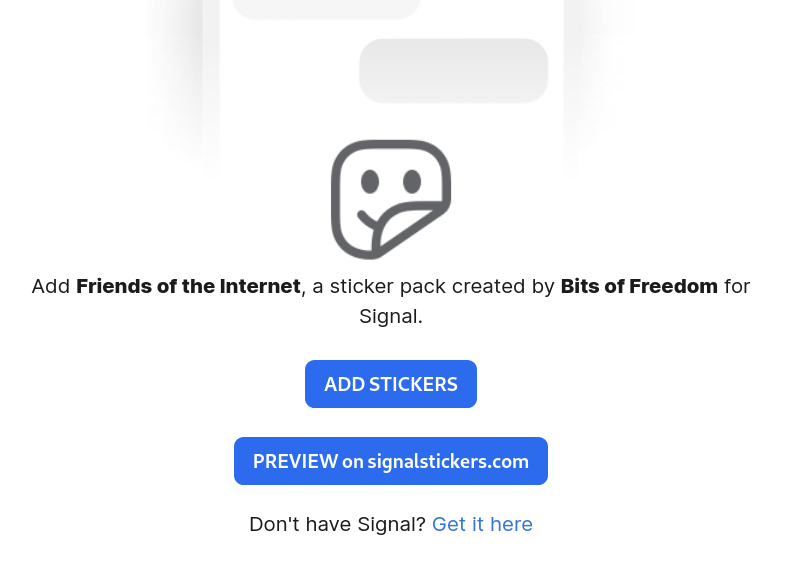

This quick and dirty Firefox/Chrome extension adds a "Preview" button on `signal.art`, that
allows to open a pack on `signalstickers.com` for easier preview.

## Install of Firefox

Go to URL `about:config`, search for `xpinstall.signatures.required` and double-click on the value to set it to `false`. 

Then, in `about:addons`, click on the wheel, select "Install add-on from file", and select `signal.art_preview-[version].zip`.

## Install on Chrome

Go to URL `chrome://extensions/`, enable Developper mode, then load this folder.

## Build

> A packaged version is available in the `web-ext-artifacts' directory.

Install [Firefox's tool Web-ext](https://developer.mozilla.org/fr/docs/Mozilla/Add-ons/WebExtensions/Getting_started_with_web-ext).  
Then, do `web-ext build`.
